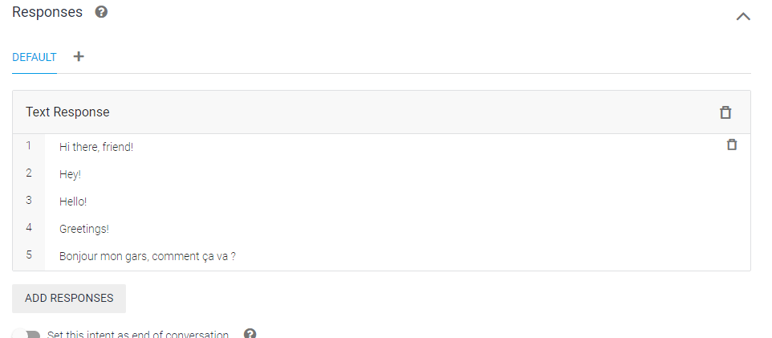
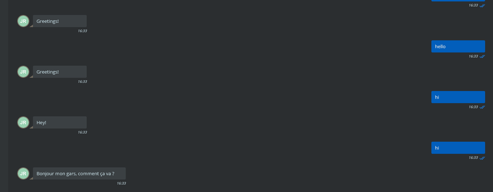
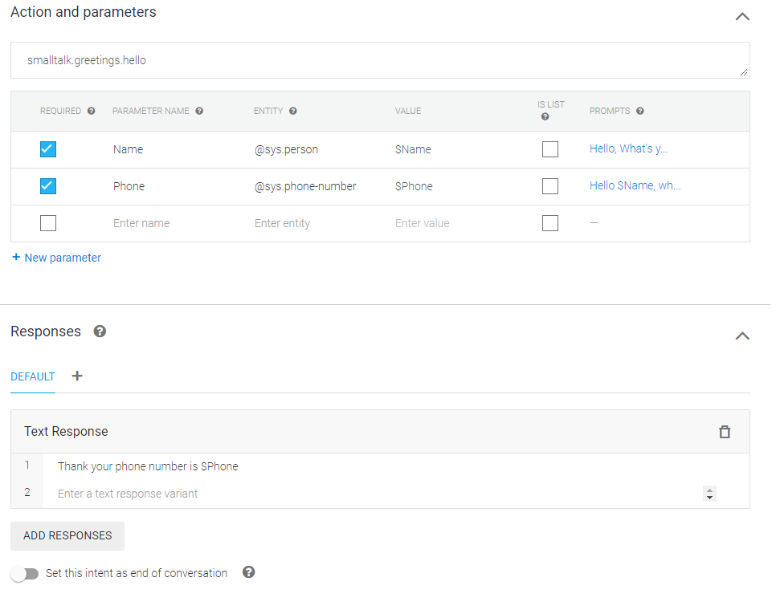

# multimedia-on-ip

## Jean-Michel REMEUR & Thomas LACAZE
## EFREI M1 APP LSI

## Custom hi

### Dialogflow configuration



### Responses




## Ask name and phone number

### Dialogflow configuration


### Responses


## Messenger

### Configuration


### Dialogflow configuration


### Responses


## Code (Typescript)

```typescript
require("dotenv").config();
import { SessionsClient } from '@google-cloud/dialogflow';
import { v4 } from 'uuid';
const RainbowSDK = require('rainbow-node-sdk');

const options = {
  rainbow: {
    host: "sandbox"
  },
  credentials: {
    login: process.env.LOGIN,
    password: process.env.PASSWORD
  },
  application: {
    appID: process.env.ID,
    appSecret: process.env.APP_SECRET
  },
  logs: {
    enableConsoleLogs: true,              
    enableFileLogs: false,                
    file: {
      path: '/var/tmp/rainbowsdk/',
      level: 'debug'                    
    }
  },
  im: {
    sendReadReceipt: true   
  }
}

const projectId = process.env.PROJECT_ID;
const credentials_file_path = './small_talk.json';
const sessionId = v4();

const rainbowSDK = new RainbowSDK(options);

rainbowSDK.start().then( () => {
  console.log("Started...");
});

rainbowSDK.events.on('rainbow_onmessagereceived', async (msg) => {
  const response = await runSample(projectId, msg.content);
  rainbowSDK.im.sendMessageToJid(response, msg.fromJid);
});

async function runSample(projectId: string, query: string) {
  const languageCode = "en-US";

  const sessionClient = new SessionsClient({
    projectId,
    keyFilename: credentials_file_path,
  });

  const sessionPath = sessionClient.projectAgentSessionPath(projectId, sessionId);

  const request = {
    session: sessionPath,
    queryInput: {
      text: {
        text: query,
        languageCode: languageCode,
      },
    },
  };

  const responses = await sessionClient.detectIntent(request);

  const result = responses[0].queryResult;

  console.log(`Query: ${result.queryText}`);
  console.log(`Response: ${result.fulfillmentText}`);

  return result.fulfillmentText;
}
```

### Package.json

```json
{
  "name": "multimedia-on-ip",
  "version": "1.0.0",
  "description": "",
  "main": "src/index.ts",
  "scripts": {
    "start": "tsc && node dist/index.js",
    "build": "tsc"
  },
  "author": "JM REMEUR, THOMAS LACAZE",
  "license": "MIT",
  "dependencies": {
    "@google-cloud/dialogflow": "^3.3.0",
    "@types/uuid": "^8.3.0",
    "dotenv": "^8.2.0",
    "rainbow-node-sdk": "^1.84.0",
    "uuid": "^8.3.2"
  },
  "devDependencies": {
    "@types/node": "^14.14.31",
    "typescript": "^4.2.2"
  }
}
```

### tsconfig.json

```json
{
  "compilerOptions": {
    "module": "commonjs",
    "target": "es2017",
    "noImplicitAny": false,
    "sourceMap": true,
    "outDir": "dist",
    "emitDecoratorMetadata": true,
    "experimentalDecorators": true,
    "importHelpers": true,
    "forceConsistentCasingInFileNames": true,
    "lib": [
      "es2017",
      "esnext.asynciterable"
    ],
    "moduleResolution": "node",
    "types": [ "node" ], 
  },
  "exclude": [
    "node_modules"
  ]
}
```

### .env

```ini
APP_SECRET=
ID=
LOGIN=
PASSWORD=
PROJECT_ID=
```